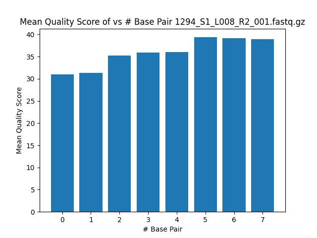
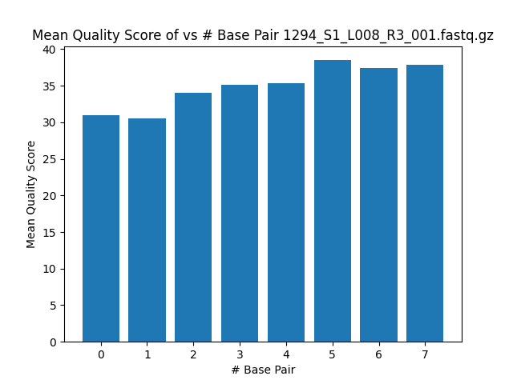
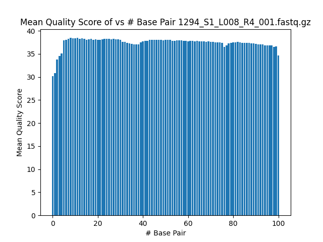

# Assignment the First

## Part 1
1. Be sure to upload your Python script.

| File name | label | Read length | Phred encoding |
|---|---|---|---|
| 1294_S1_L008_R1_001.fastq.gz | read1 | 101 | 33 |
| 1294_S1_L008_R2_001.fastq.gz | index1 | 8 | 33 |
| 1294_S1_L008_R3_001.fastq.gz | index2 | 8 | 33 |
| 1294_S1_L008_R4_001.fastq.gz | read2 | 101 | 33 |

2. Per-base NT distribution

    i. 
    
    
    
    
    
ii. According to the histograms, I believe that a good quality score cutoff for both index reads and biological read pairs is 30 because most of the quality scores fall above 30. 

iii. zcat 1294_S1_L008_R2_001.fastq.gz | sed -n '2~4p' | grep "N" | wc -l

    3976613 indices contain an N
zcat 1294_S1_L008_R3_001.fastq.gz | sed -n '2~4p' | grep "N" | wc -l

    3328051 indices contain an N

    
## Part 2
1. Define the problem
    - De-multiplex files and reporting index-hopping. 
2. Describe output
   - One R1 FASTQ file and one R2 FASTQ file per matching index-pair. 
   - Two FASTQ files for non-matching index-pairs
   - Two FASTQ files when one or both index reads are unknown or low quality or do not meet a quality score cutoff. 
   - Add the sequence of the index-pair to the header of BOTH reads in all of your FASTQ files for all categories 
   - Report the number of read-pairs with properly matched indexes (per index-pair), the number of read pairs with index-hopping observed, and the number of read-pairs with unknown index(es).
3. Upload your [4 input FASTQ files](../TEST-input_FASTQ) and your [>=6 expected output FASTQ files](../TEST-output_FASTQ).
4. Pseudocode
    - Create a set of the known 24 indexes. 
    - Collect the 4 lines of a record and iterate through each record. 
        - Arrays: read1[header,seq,+,Q], read2[header,seq,+,Q], and so on...
    - Check if the sequence of the "nth" record of index1 is in the set.
        - If is not one of the 24 known indexes send it and its corresponding record in read1 to the "read1_unknown" FASTQ file and its corresponding record in read2 to the "read2_unknown" FASTQ file.
            - unknown_count += 1. 
        - If the index is one of the 24 known indexes in the set, check if the reverse compliment of the "nth" record of index2 is also in set. 
            - Convert the phred score of each base in the "nth" record of the index1 and index2 sequence.
                - If there is one base that is below 30 in either the index1 or index2 sequence, put its corresponding read1 record into "read1_unknown" FASTQ file and its corresponding record in read2 into "read2_unknown".
                    - unknown_count +=1. 
                    - Check if the sequence of the nth record of index1 is equal to the reverse comp of index2 and send its corresponding read1 record into "read1_index1" FASTQ file and its corresponding read2 record into "read2_index2(reversecomp)" FASTQ file. 
                        - matched_count += 1. 
                    - If the sequences do not match, send corresponding read1 record into the "read1_unmatched" FASTQ file and the corresponding read2 record into the "read2_unmatched" FASTQ file. 
                        - unmatched_count += 1. 
    - When putting records into respective files, add @header_index_index2(reverse comp). 
            - Overwriting header: array[0] = array[0] + index, index2(reverse comp)
            - Writing to the files: fh.write(f"{read1[0]}_{index1[1]}_index2[1]}\n")), fh.write(f"{read[1]}\n{read[2]}\n{read[3]}\n")
5. High level functions. For each function, be sure to include:
   - Reverse Compliment function:
        - Description: Takes a sequence line and writes the reverse compliment of it. 
        - Function header: def rev_comp(sequence_line):
        - Test examples: Input: AGT, Output: ACT; Input: TGA, Output: TCA, etc. 
        - Return reverse compliment of the sequence line 
   - Grab 4 lines of a fastq file at a time function:
        - Description: Grabs 4 lines of a FASTQ file at a time and stores each one to a variable. 
        - Function header: def fastq_lines(file):
        - Test examples: Input: FASTQ file; Output: header, sequence, plus, phred
        - Return each line variable
   - Convert phred scores
        - Description: Converts a single character into a phred score
        - Function header: convert_phred(letter: str) -> int:
        - Test examples: Input: I, Output: 40; Input: A, Output: 32
        - Return converted phred score
   - Write out the file
        - Description: Writes 4 lines of a FASTQ file to respective file
        - Function header: file_write(fastq_read):
        - Test examples: Input: 4 lines of FASTQ record; Output: respective file
        - Return files 
