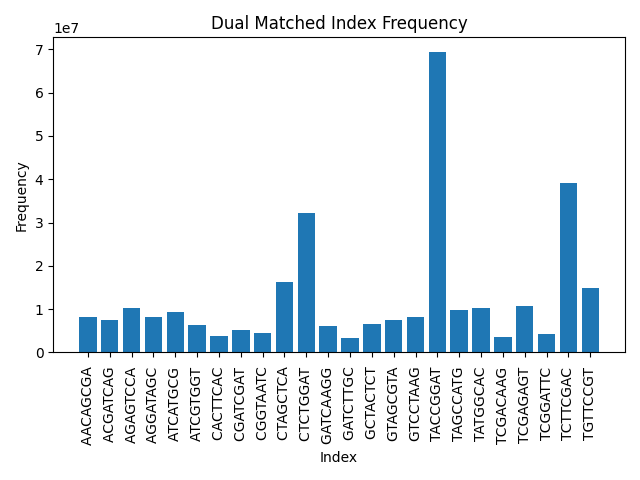
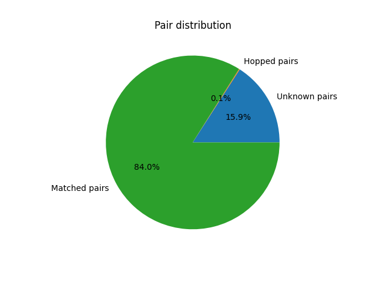

# Demultiplexing Script Output

## Total counts
```
Total number of unknown index pairs:  57748853
Total number of hopped index pairs:  517612
Total number of matched index pairs:  304980270
Total number of records:  363246735 
```

## Matched indexes and counts
```
Matched indexes
Index	Count	Percentage
AACAGCGA:AACAGCGA	8178191	2.2514148681886983
ACGATCAG:ACGATCAG	7441721	2.0486683796345755
AGAGTCCA:AGAGTCCA	10378366	2.85711198477806
AGGATAGC:AGGATAGC	8078057	2.2238484813910304
ATCATGCG:ATCATGCG	9264615	2.550501933623712
ATCGTGGT:ATCGTGGT	6357656	1.7502307350401924
CACTTCAC:CACTTCAC	3833640	1.055381819192401
CGATCGAT:CGATCGAT	5225776	1.4386298613255257
CGGTAATC:CGGTAATC	4498136	1.2383142273804608
CTAGCTCA:CTAGCTCA	16162895	4.449563737992029
CTCTGGAT:CTCTGGAT	32163349	8.854408285321545
GATCAAGG:GATCAAGG	6085915	1.6754218038601227
GATCTTGC:GATCTTGC	3425453	0.9430099901655
GCTACTCT:GCTACTCT	6610857	1.8199356974261585
GTAGCGTA:GTAGCGTA	7450201	2.0510028810031837
GTCCTAAG:GTCCTAAG	8164223	2.2475695480098397
TACCGGAT:TACCGGAT	69307073	19.079888770369816
TAGCCATG:TAGCCATG	9852258	2.7122770972738404
TATGGCAC:TATGGCAC	10195805	2.8068538592645575
TCGACAAG:TCGACAAG	3548541	0.9768954977668278
TCGAGAGT:TCGAGAGT	10658212	2.9341521817119705
TCGGATTC:TCGGATTC	4163314 1.146139414026667
TCTTCGAC:TCTTCGAC	39149148	10.777563630406755
TGTTCCGT:TGTTCCGT	14786868	4.070750422574342
```

## Hopped indexes and counts
```
Hopped indexes
Index1:Index2	Count
AACAGCGA:ACGATCAG	343
AACAGCGA:AGAGTCCA	340
AACAGCGA:AGGATAGC	350
AACAGCGA:ATCATGCG	428
AACAGCGA:ATCGTGGT	286
AACAGCGA:CACTTCAC	120
AACAGCGA:CGATCGAT	231
AACAGCGA:CGGTAATC	114
AACAGCGA:CTAGCTCA	404
AACAGCGA:CTCTGGAT	818
AACAGCGA:GATCAAGG	234
AACAGCGA:GATCTTGC	506
AACAGCGA:GCTACTCT	153
AACAGCGA:GTAGCGTA	314
AACAGCGA:GTCCTAAG	238
AACAGCGA:TACCGGAT	1716
AACAGCGA:TAGCCATG	230
AACAGCGA:TATGGCAC	334
AACAGCGA:TCGACAAG	92
AACAGCGA:TCGAGAGT	298
AACAGCGA:TCGGATTC	282
AACAGCGA:TCTTCGAC	1555
AACAGCGA:TGTTCCGT	361
ACGATCAG:AACAGCGA	199
ACGATCAG:AGAGTCCA	329
ACGATCAG:AGGATAGC	299
ACGATCAG:ATCATGCG	324
ACGATCAG:ATCGTGGT	161
ACGATCAG:CACTTCAC	133
ACGATCAG:CGATCGAT	272
ACGATCAG:CGGTAATC	149
ACGATCAG:CTAGCTCA	377
ACGATCAG:CTCTGGAT	697
ACGATCAG:GATCAAGG	224
ACGATCAG:GATCTTGC	124
ACGATCAG:GCTACTCT	228
ACGATCAG:GTAGCGTA	202
ACGATCAG:GTCCTAAG	323
ACGATCAG:TACCGGAT	1549
ACGATCAG:TAGCCATG	326
ACGATCAG:TATGGCAC	285
ACGATCAG:TCGACAAG	250
ACGATCAG:TCGAGAGT	369
ACGATCAG:TCGGATTC	117
ACGATCAG:TCTTCGAC	836
ACGATCAG:TGTTCCGT	369
AGAGTCCA:AACAGCGA	331
AGAGTCCA:ACGATCAG	408
AGAGTCCA:AGGATAGC	339
AGAGTCCA:ATCATGCG	291
AGAGTCCA:ATCGTGGT	220
AGAGTCCA:CACTTCAC	127
AGAGTCCA:CGATCGAT	200
AGAGTCCA:CGGTAATC	147
AGAGTCCA:CTAGCTCA	766
AGAGTCCA:CTCTGGAT	754
AGAGTCCA:GATCAAGG	162
AGAGTCCA:GATCTTGC	110
AGAGTCCA:GCTACTCT	232
AGAGTCCA:GTAGCGTA	878
AGAGTCCA:GTCCTAAG	233
AGAGTCCA:TACCGGAT	1699
AGAGTCCA:TAGCCATG	261
AGAGTCCA:TATGGCAC	324
AGAGTCCA:TCGACAAG	90
AGAGTCCA:TCGAGAGT	779
AGAGTCCA:TCGGATTC	141
AGAGTCCA:TCTTCGAC	941
AGAGTCCA:TGTTCCGT	456
AGGATAGC:AACAGCGA	222
AGGATAGC:ACGATCAG	369
AGGATAGC:AGAGTCCA	342
AGGATAGC:ATCATGCG	350
AGGATAGC:ATCGTGGT	173
AGGATAGC:CACTTCAC	267
AGGATAGC:CGATCGAT	201
AGGATAGC:CGGTAATC	198
AGGATAGC:CTAGCTCA	343
AGGATAGC:CTCTGGAT	607
AGGATAGC:GATCAAGG	127
AGGATAGC:GATCTTGC	391
AGGATAGC:GCTACTCT	276
AGGATAGC:GTAGCGTA	782
AGGATAGC:GTCCTAAG	179
AGGATAGC:TACCGGAT	1277
AGGATAGC:TAGCCATG	221
AGGATAGC:TATGGCAC	378
AGGATAGC:TCGACAAG	88
AGGATAGC:TCGAGAGT	322
AGGATAGC:TCGGATTC	210
AGGATAGC:TCTTCGAC	1239
AGGATAGC:TGTTCCGT	339
ATCATGCG:AACAGCGA	363
ATCATGCG:ACGATCAG	550
ATCATGCG:AGAGTCCA	380
ATCATGCG:AGGATAGC	396
ATCATGCG:ATCGTGGT	324
ATCATGCG:CACTTCAC	127
ATCATGCG:CGATCGAT	177
ATCATGCG:CGGTAATC	135
ATCATGCG:CTAGCTCA	474
ATCATGCG:CTCTGGAT	965
ATCATGCG:GATCAAGG	351
ATCATGCG:GATCTTGC	180
ATCATGCG:GCTACTCT	221
ATCATGCG:GTAGCGTA	200
ATCATGCG:GTCCTAAG	462
ATCATGCG:TACCGGAT	1600
ATCATGCG:TAGCCATG	617
ATCATGCG:TATGGCAC	605
ATCATGCG:TCGACAAG	235
ATCATGCG:TCGAGAGT	316
ATCATGCG:TCGGATTC	138
ATCATGCG:TCTTCGAC	1203
ATCATGCG:TGTTCCGT	437
ATCGTGGT:AACAGCGA	148
ATCGTGGT:ACGATCAG	223
ATCGTGGT:AGAGTCCA	218
ATCGTGGT:AGGATAGC	197
ATCGTGGT:ATCATGCG	227
ATCGTGGT:CACTTCAC	61
ATCGTGGT:CGATCGAT	157
ATCGTGGT:CGGTAATC	121
ATCGTGGT:CTAGCTCA	276
ATCGTGGT:CTCTGGAT	943
ATCGTGGT:GATCAAGG	503
ATCGTGGT:GATCTTGC	93
ATCGTGGT:GCTACTCT	172
ATCGTGGT:GTAGCGTA	175
ATCGTGGT:GTCCTAAG	129
ATCGTGGT:TACCGGAT	1409
ATCGTGGT:TAGCCATG	152
ATCGTGGT:TATGGCAC	207
ATCGTGGT:TCGACAAG	77
ATCGTGGT:TCGAGAGT	326
ATCGTGGT:TCGGATTC	101
ATCGTGGT:TCTTCGAC	1019
ATCGTGGT:TGTTCCGT	284
CACTTCAC:AACAGCGA	77
CACTTCAC:ACGATCAG	274
CACTTCAC:AGAGTCCA	122
CACTTCAC:AGGATAGC	153
CACTTCAC:ATCATGCG	99
CACTTCAC:ATCGTGGT	78
CACTTCAC:CGATCGAT	143
CACTTCAC:CGGTAATC	168
CACTTCAC:CTAGCTCA	220
CACTTCAC:CTCTGGAT	481
CACTTCAC:GATCAAGG	83
CACTTCAC:GATCTTGC	69
CACTTCAC:GCTACTCT	69
CACTTCAC:GTAGCGTA	82
CACTTCAC:GTCCTAAG	84
CACTTCAC:TACCGGAT	745
CACTTCAC:TAGCCATG	2860
CACTTCAC:TATGGCAC	243
CACTTCAC:TCGACAAG	42
CACTTCAC:TCGAGAGT	106
CACTTCAC:TCGGATTC	100
CACTTCAC:TCTTCGAC	677
CACTTCAC:TGTTCCGT	197
CGATCGAT:AACAGCGA	116
CGATCGAT:ACGATCAG	187
CGATCGAT:AGAGTCCA	185
CGATCGAT:AGGATAGC	220
CGATCGAT:ATCATGCG	136
CGATCGAT:ATCGTGGT	116
CGATCGAT:CACTTCAC	89
CGATCGAT:CGGTAATC	147
CGATCGAT:CTAGCTCA	292
CGATCGAT:CTCTGGAT	873
CGATCGAT:GATCAAGG	114
CGATCGAT:GATCTTGC	89
CGATCGAT:GCTACTCT	140
CGATCGAT:GTAGCGTA	147
CGATCGAT:GTCCTAAG	150
CGATCGAT:TACCGGAT	1482
CGATCGAT:TAGCCATG	160
CGATCGAT:TATGGCAC	136
CGATCGAT:TCGACAAG	81
CGATCGAT:TCGAGAGT	205
CGATCGAT:TCGGATTC	87
CGATCGAT:TCTTCGAC	850
CGATCGAT:TGTTCCGT	366
CGGTAATC:AACAGCGA	82
CGGTAATC:ACGATCAG	103
CGGTAATC:AGAGTCCA	115
CGGTAATC:AGGATAGC	201
CGGTAATC:ATCATGCG	100
CGGTAATC:ATCGTGGT	280
CGGTAATC:CACTTCAC	147
CGGTAATC:CGATCGAT	135
CGGTAATC:CTAGCTCA	205
CGGTAATC:CTCTGGAT	431
CGGTAATC:GATCAAGG	105
CGGTAATC:GATCTTGC	81
CGGTAATC:GCTACTCT	79
CGGTAATC:GTAGCGTA	88
CGGTAATC:GTCCTAAG	75
CGGTAATC:TACCGGAT	5971
CGGTAATC:TAGCCATG	239
CGGTAATC:TATGGCAC	151
CGGTAATC:TCGACAAG	50
CGGTAATC:TCGAGAGT	124
CGGTAATC:TCGGATTC	107
CGGTAATC:TCTTCGAC	807
CGGTAATC:TGTTCCGT	172
CTAGCTCA:AACAGCGA	400
CTAGCTCA:ACGATCAG	537
CTAGCTCA:AGAGTCCA	769
CTAGCTCA:AGGATAGC	397
CTAGCTCA:ATCATGCG	1472
CTAGCTCA:ATCGTGGT	339
CTAGCTCA:CACTTCAC	218
CTAGCTCA:CGATCGAT	388
CTAGCTCA:CGGTAATC	274
CTAGCTCA:CTCTGGAT	2871
CTAGCTCA:GATCAAGG	305
CTAGCTCA:GATCTTGC	242
CTAGCTCA:GCTACTCT	1486
CTAGCTCA:GTAGCGTA	869
CTAGCTCA:GTCCTAAG	443
CTAGCTCA:TACCGGAT	2996
CTAGCTCA:TAGCCATG	567
CTAGCTCA:TATGGCAC	591
CTAGCTCA:TCGACAAG	13254
CTAGCTCA:TCGAGAGT	808
CTAGCTCA:TCGGATTC	285
CTAGCTCA:TCTTCGAC	1679
CTAGCTCA:TGTTCCGT	690
CTCTGGAT:AACAGCGA	684
CTCTGGAT:ACGATCAG	874
CTCTGGAT:AGAGTCCA	1407
CTCTGGAT:AGGATAGC	719
CTCTGGAT:ATCATGCG	830
CTCTGGAT:ATCGTGGT	729
CTCTGGAT:CACTTCAC	506
CTCTGGAT:CGATCGAT	1453
CTCTGGAT:CGGTAATC	577
CTCTGGAT:CTAGCTCA	2109
CTCTGGAT:GATCAAGG	517
CTCTGGAT:GATCTTGC	436
CTCTGGAT:GCTACTCT	2028
CTCTGGAT:GTAGCGTA	745
CTCTGGAT:GTCCTAAG	821
CTCTGGAT:TACCGGAT	9772
CTCTGGAT:TAGCCATG	837
CTCTGGAT:TATGGCAC	1168
CTCTGGAT:TCGACAAG	385
CTCTGGAT:TCGAGAGT	1604
CTCTGGAT:TCGGATTC	540
CTCTGGAT:TCTTCGAC	4193
CTCTGGAT:TGTTCCGT	1620
GATCAAGG:AACAGCGA	128
GATCAAGG:ACGATCAG	406
GATCAAGG:AGAGTCCA	165
GATCAAGG:AGGATAGC	159
GATCAAGG:ATCATGCG	183
GATCAAGG:ATCGTGGT	322
GATCAAGG:CACTTCAC	64
GATCAAGG:CGATCGAT	136
GATCAAGG:CGGTAATC	79
GATCAAGG:CTAGCTCA	203
GATCAAGG:CTCTGGAT	474
GATCAAGG:GATCTTGC	149
GATCAAGG:GCTACTCT	142
GATCAAGG:GTAGCGTA	183
GATCAAGG:GTCCTAAG	298
GATCAAGG:TACCGGAT	1045
GATCAAGG:TAGCCATG	240
GATCAAGG:TATGGCAC	180
GATCAAGG:TCGACAAG	99
GATCAAGG:TCGAGAGT	195
GATCAAGG:TCGGATTC	77
GATCAAGG:TCTTCGAC	15551
GATCAAGG:TGTTCCGT	239
GATCTTGC:AACAGCGA	131
GATCTTGC:ACGATCAG	111
GATCTTGC:AGAGTCCA	127
GATCTTGC:AGGATAGC	263
GATCTTGC:ATCATGCG	159
GATCTTGC:ATCGTGGT	62
GATCTTGC:CACTTCAC	78
GATCTTGC:CGATCGAT	165
GATCTTGC:CGGTAATC	89
GATCTTGC:CTAGCTCA	148
GATCTTGC:CTCTGGAT	275
GATCTTGC:GATCAAGG	122
GATCTTGC:GCTACTCT	93
GATCTTGC:GTAGCGTA	116
GATCTTGC:GTCCTAAG	114
GATCTTGC:TACCGGAT	530
GATCTTGC:TAGCCATG	78
GATCTTGC:TATGGCAC	181
GATCTTGC:TCGACAAG	31
GATCTTGC:TCGAGAGT	107
GATCTTGC:TCGGATTC	61
GATCTTGC:TCTTCGAC	520
GATCTTGC:TGTTCCGT	130
GCTACTCT:AACAGCGA	168
GCTACTCT:ACGATCAG	250
GCTACTCT:AGAGTCCA	312
GCTACTCT:AGGATAGC	162
GCTACTCT:ATCATGCG	198
GCTACTCT:ATCGTGGT	138
GCTACTCT:CACTTCAC	66
GCTACTCT:CGATCGAT	141
GCTACTCT:CGGTAATC	95
GCTACTCT:CTAGCTCA	431
GCTACTCT:CTCTGGAT	785
GCTACTCT:GATCAAGG	144
GCTACTCT:GATCTTGC	110
GCTACTCT:GTAGCGTA	513
GCTACTCT:GTCCTAAG	217
GCTACTCT:TACCGGAT	1256
GCTACTCT:TAGCCATG	185
GCTACTCT:TATGGCAC	211
GCTACTCT:TCGACAAG	71
GCTACTCT:TCGAGAGT	291
GCTACTCT:TCGGATTC	93
GCTACTCT:TCTTCGAC	747
GCTACTCT:TGTTCCGT	406
GTAGCGTA:AACAGCGA	222
GTAGCGTA:ACGATCAG	640
GTAGCGTA:AGAGTCCA	357
GTAGCGTA:AGGATAGC	197
GTAGCGTA:ATCATGCG	210
GTAGCGTA:ATCGTGGT	195
GTAGCGTA:CACTTCAC	74
GTAGCGTA:CGATCGAT	144
GTAGCGTA:CGGTAATC	104
GTAGCGTA:CTAGCTCA	586
GTAGCGTA:CTCTGGAT	600
GTAGCGTA:GATCAAGG	156
GTAGCGTA:GATCTTGC	96
GTAGCGTA:GCTACTCT	1333
GTAGCGTA:GTCCTAAG	272
GTAGCGTA:TACCGGAT	1261
GTAGCGTA:TAGCCATG	197
GTAGCGTA:TATGGCAC	236
GTAGCGTA:TCGACAAG	72
GTAGCGTA:TCGAGAGT	574
GTAGCGTA:TCGGATTC	101
GTAGCGTA:TCTTCGAC	800
GTAGCGTA:TGTTCCGT	361
GTCCTAAG:AACAGCGA	332
GTCCTAAG:ACGATCAG	262
GTCCTAAG:AGAGTCCA	223
GTCCTAAG:AGGATAGC	183
GTCCTAAG:ATCATGCG	268
GTCCTAAG:ATCGTGGT	157
GTCCTAAG:CACTTCAC	88
GTCCTAAG:CGATCGAT	178
GTCCTAAG:CGGTAATC	99
GTCCTAAG:CTAGCTCA	346
GTCCTAAG:CTCTGGAT	732
GTCCTAAG:GATCAAGG	285
GTCCTAAG:GATCTTGC	144
GTCCTAAG:GCTACTCT	201
GTCCTAAG:GTAGCGTA	242
GTCCTAAG:TACCGGAT	1559
GTCCTAAG:TAGCCATG	286
GTCCTAAG:TATGGCAC	6276
GTCCTAAG:TCGACAAG	130
GTCCTAAG:TCGAGAGT	244
GTCCTAAG:TCGGATTC	219
GTCCTAAG:TCTTCGAC	830
GTCCTAAG:TGTTCCGT	734
TACCGGAT:AACAGCGA	1410
TACCGGAT:ACGATCAG	1707
TACCGGAT:AGAGTCCA	1747
TACCGGAT:AGGATAGC	1566
TACCGGAT:ATCATGCG	1561
TACCGGAT:ATCGTGGT	1531
TACCGGAT:CACTTCAC	958
TACCGGAT:CGATCGAT	1414
TACCGGAT:CGGTAATC	2155
TACCGGAT:CTAGCTCA	3030
TACCGGAT:CTCTGGAT	10382
TACCGGAT:GATCAAGG	1267
TACCGGAT:GATCTTGC	801
TACCGGAT:GCTACTCT	1208
TACCGGAT:GTAGCGTA	1250
TACCGGAT:GTCCTAAG	1625
TACCGGAT:TAGCCATG	2676
TACCGGAT:TATGGCAC	2745
TACCGGAT:TCGACAAG	735
TACCGGAT:TCGAGAGT	2572
TACCGGAT:TCGGATTC	1001
TACCGGAT:TCTTCGAC	8676
TACCGGAT:TGTTCCGT	3515
TAGCCATG:AACAGCGA	160
TAGCCATG:ACGATCAG	285
TAGCCATG:AGAGTCCA	254
TAGCCATG:AGGATAGC	195
TAGCCATG:ATCATGCG	264
TAGCCATG:ATCGTGGT	142
TAGCCATG:CACTTCAC	195
TAGCCATG:CGATCGAT	111
TAGCCATG:CGGTAATC	104
TAGCCATG:CTAGCTCA	439
TAGCCATG:CTCTGGAT	695
TAGCCATG:GATCAAGG	260
TAGCCATG:GATCTTGC	116
TAGCCATG:GCTACTCT	148
TAGCCATG:GTAGCGTA	199
TAGCCATG:GTCCTAAG	300
TAGCCATG:TACCGGAT	1771
TAGCCATG:TATGGCAC	321
TAGCCATG:TCGACAAG	157
TAGCCATG:TCGAGAGT	294
TAGCCATG:TCGGATTC	134
TAGCCATG:TCTTCGAC	945
TAGCCATG:TGTTCCGT	396
TATGGCAC:AACAGCGA	512
TATGGCAC:ACGATCAG	381
TATGGCAC:AGAGTCCA	314
TATGGCAC:AGGATAGC	435
TATGGCAC:ATCATGCG	315
TATGGCAC:ATCGTGGT	232
TATGGCAC:CACTTCAC	347
TATGGCAC:CGATCGAT	190
TATGGCAC:CGGTAATC	243
TATGGCAC:CTAGCTCA	567
TATGGCAC:CTCTGGAT	1134
TATGGCAC:GATCAAGG	240
TATGGCAC:GATCTTGC	261
TATGGCAC:GCTACTCT	235
TATGGCAC:GTAGCGTA	234
TATGGCAC:GTCCTAAG	580
TATGGCAC:TACCGGAT	3404
TATGGCAC:TAGCCATG	383
TATGGCAC:TCGACAAG	178
TATGGCAC:TCGAGAGT	695
TATGGCAC:TCGGATTC	785
TATGGCAC:TCTTCGAC	3173
TATGGCAC:TGTTCCGT	82265
TCGACAAG:AACAGCGA	63
TCGACAAG:ACGATCAG	182
TCGACAAG:AGAGTCCA	92
TCGACAAG:AGGATAGC	118
TCGACAAG:ATCATGCG	7188
TCGACAAG:ATCGTGGT	61
TCGACAAG:CACTTCAC	20
TCGACAAG:CGATCGAT	74
TCGACAAG:CGGTAATC	37
TCGACAAG:CTAGCTCA	153
TCGACAAG:CTCTGGAT	296
TCGACAAG:GATCAAGG	102
TCGACAAG:GATCTTGC	38
TCGACAAG:GCTACTCT	76
TCGACAAG:GTAGCGTA	69
TCGACAAG:GTCCTAAG	168
TCGACAAG:TACCGGAT	623
TCGACAAG:TAGCCATG	206
TCGACAAG:TATGGCAC	118
TCGACAAG:TCGAGAGT	254
TCGACAAG:TCGGATTC	73
TCGACAAG:TCTTCGAC	437
TCGACAAG:TGTTCCGT	140
TCGAGAGT:AACAGCGA	244
TCGAGAGT:ACGATCAG	503
TCGAGAGT:AGAGTCCA	306
TCGAGAGT:AGGATAGC	355
TCGAGAGT:ATCATGCG	276
TCGAGAGT:ATCGTGGT	329
TCGAGAGT:CACTTCAC	110
TCGAGAGT:CGATCGAT	256
TCGAGAGT:CGGTAATC	180
TCGAGAGT:CTAGCTCA	525
TCGAGAGT:CTCTGGAT	1286
TCGAGAGT:GATCAAGG	206
TCGAGAGT:GATCTTGC	153
TCGAGAGT:GCTACTCT	465
TCGAGAGT:GTAGCGTA	247
TCGAGAGT:GTCCTAAG	259
TCGAGAGT:TACCGGAT	2525
TCGAGAGT:TAGCCATG	290
TCGAGAGT:TATGGCAC	328
TCGAGAGT:TCGACAAG	239
TCGAGAGT:TCGGATTC	274
TCGAGAGT:TCTTCGAC	1383
TCGAGAGT:TGTTCCGT	671
TCGGATTC:AACAGCGA	861
TCGGATTC:ACGATCAG	137
TCGGATTC:AGAGTCCA	131
TCGGATTC:AGGATAGC	191
TCGGATTC:ATCATGCG	104
TCGGATTC:ATCGTGGT	78
TCGGATTC:CACTTCAC	85
TCGGATTC:CGATCGAT	203
TCGGATTC:CGGTAATC	128
TCGGATTC:CTAGCTCA	230
TCGGATTC:CTCTGGAT	405
TCGGATTC:GATCAAGG	91
TCGGATTC:GATCTTGC	231
TCGGATTC:GCTACTCT	75
TCGGATTC:GTAGCGTA	85
TCGGATTC:GTCCTAAG	105
TCGGATTC:TACCGGAT	727
TCGGATTC:TAGCCATG	117
TCGGATTC:TATGGCAC	287
TCGGATTC:TCGACAAG	57
TCGGATTC:TCGAGAGT	166
TCGGATTC:TCTTCGAC	833
TCGGATTC:TGTTCCGT	189
TCTTCGAC:AACAGCGA	708
TCTTCGAC:ACGATCAG	1120
TCTTCGAC:AGAGTCCA	1020
TCTTCGAC:AGGATAGC	1308
TCTTCGAC:ATCATGCG	979
TCTTCGAC:ATCGTGGT	3861
TCTTCGAC:CACTTCAC	689
TCTTCGAC:CGATCGAT	875
TCTTCGAC:CGGTAATC	780
TCTTCGAC:CTAGCTCA	1860
TCTTCGAC:CTCTGGAT	4102
TCTTCGAC:GATCAAGG	1504
TCTTCGAC:GATCTTGC	739
TCTTCGAC:GCTACTCT	826
TCTTCGAC:GTAGCGTA	838
TCTTCGAC:GTCCTAAG	884
TCTTCGAC:TACCGGAT	7656
TCTTCGAC:TAGCCATG	1117
TCTTCGAC:TATGGCAC	2040
TCTTCGAC:TCGACAAG	635
TCTTCGAC:TCGAGAGT	1786
TCTTCGAC:TCGGATTC	1033
TCTTCGAC:TGTTCCGT	2270
TGTTCCGT:AACAGCGA	621
TGTTCCGT:ACGATCAG	375
TGTTCCGT:AGAGTCCA	547
TGTTCCGT:AGGATAGC	370
TGTTCCGT:ATCATGCG	464
TGTTCCGT:ATCGTGGT	316
TGTTCCGT:CACTTCAC	204
TGTTCCGT:CGATCGAT	407
TGTTCCGT:CGGTAATC	186
TGTTCCGT:CTAGCTCA	643
TGTTCCGT:CTCTGGAT	1343
TGTTCCGT:GATCAAGG	247
TGTTCCGT:GATCTTGC	251
TGTTCCGT:GCTACTCT	323
TGTTCCGT:GTAGCGTA	369
TGTTCCGT:GTCCTAAG	305
TGTTCCGT:TACCGGAT	3285
TGTTCCGT:TAGCCATG	405
TGTTCCGT:TATGGCAC	78364
TGTTCCGT:TCGACAAG	164
TGTTCCGT:TCGAGAGT	656
TGTTCCGT:TCGGATTC	723
TGTTCCGT:TCTTCGAC	2001
```
## Output figures

